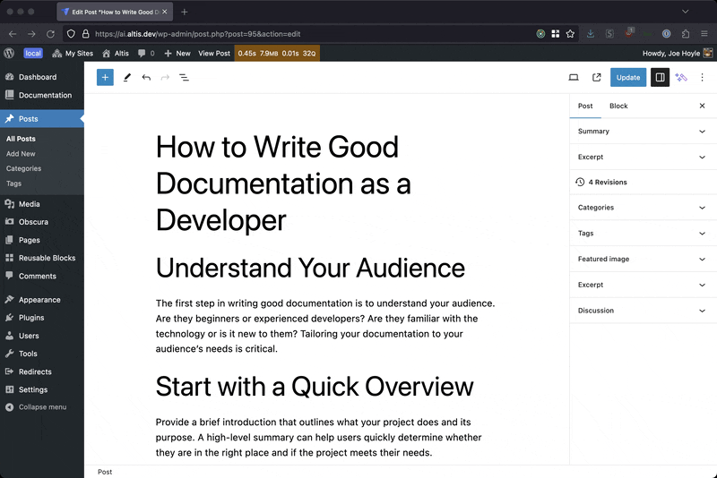

# WordPress AI

> [!NOTE]
> This project is evolving quickly, and should be considered a proof-of-concept. Use it as a reference to take code, modify, learn and contribute. We are not currently providing the plugin as an end-user solution. The plugin has functional bugs, missing pieces etc.

This is an AI integration layer for WordPress, to make building AI powered solutions easier, faster and collaborative. This layer is relatively unopinionated, leaving decisions of UI and workflows to the solutions build on it. It does however provider several user-facing features and capabilities as a demonstration of possibilities.

## Motivation

It's out belief that AI will revolutionize the way software is built, and the way people use of software. All systems, including (and especially!) Content Management Systems will have AI embedded at a deep level, to provide cohesive, well integrated experiences. This AI layer aims to augment WordPress in a deeply integrated way to provide users of WordPress with the benefits of AI / ML capabilities and provide builders a baseline of tools, primatives, APIs and integrations to build novel AI solutions for clients, products and anyone else who may benefit from them.

## Features

### WordPress Dashboard Assistant

The Dashboard Assistant provides an assistant chat interface to your WordPress site, that can be extended by developers and plugins to add capbilities, data sources and actions. People can interact with the assistant to write content, get insights from their content or perform actions.

See [Dashboard Assistant detailed documentation](./inc/dashboard-assistant/README.md), and the underlaying [Assistants API](./inc/openai/docs/assistants.md).

### Block Editor / Gutenberg Writing Assistant

The Writing Assistant gives users the ability to generate content while writing using the Gutenberg editor. The assistant can write Gutenberg blocks, modify existing content via summarizing, changing tone, translating etc.

The writing assistant also includes a Chat sidebar which can be used to interact with the assistant for guidance, copy editing, idea generation and more.

_The Gutenberg Assistant was written before the OpenAI Assitants API existed, and is build on the Chat API. This allows for content / block streaming (which isn't supported by the Assistant API.)_

### AI Image Editor

## Frameworks and Libraries

### Post Embeddings for Semantic Search and more

Post Embeddings can be used with ElasticPress or Elasticsearch directly to provide semantic search, document retreiveal for AI integrations and knowlege / questions & answers.

### OpenAI Integration

Deep integration with [OpenAI](https://platform.openai.com/) for Chat, Assistants, Dall-e 3 and more.

### Segmind Integration

Access [Segmind](https://www.segmind.com/) APIs easily, with an API connector and authentication.

### AWS Rekognition Integration

Use [AWS Rekognition](https://aws.amazon.com/rekognition/) for object detection, image labeling, face detection and more.

### Azure Vision Integration

[Azure AI Vision](https://azure.microsoft.com/en-us/products/ai-services/ai-vision) provides APIs for image labeling, OCR and analysis.

### Clipdrop Integration

Use [Clipdrop](https://clipdrop.co/) by StabilityAI, which provides image editing capabilities.

## Usage

### Configuring

